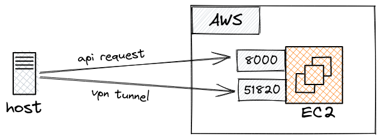

# wireguard

## Description
This is a project for setup an on-demand VPN. It was done using:
- `Wireguard`: Open source VPN software
- `AWS`: Using AWS as cloud provider
- `Terraform`: Setup all the infrastructure and configs
- `Bash`: To set up the EC2 and config client instance

## Architecture



The architecture of this project is really simple. The really small EC2 instance type, because we are only worried about networking running an API build using FastAPI (port 8000) and Wireguard (port 51820).

Since Wireguard relies on a public/private key system, I needed to share the server's public key with the host (you, in this case) and the host's public key with the server. Also, I would like to connect more than one host to the VPN, so there was a need to control the internal private IPs of the VPN.

## How to run?
First, make sure to have installed:
- Terraform
- AWS CLI
- jq

1) **Clone this repo**
```sh
git clone https://github.com/felipelaptrin/wireguard.git
cd wireguard
```

2) **Create the infrastructure**
Create the infrastructure using Terraform:
```sh
cd terraform
terraform init
terraform apply
```

Feel free to modify default values based on the README inside the `terraform` folder. By default, you only need to define (after you run `terraform apply`) the API KEY to be used to auth the incoming requests.

**PS**: I decided to use a SPOT instance to run the VPN to make it cheap and I will only use it for a couple of hours on random days and I consider this to be non-critical, so I'm ok if the spot instance is lost because of the spot market. Be aware that the instance may be interrupted by AWS at any time.

3) **Setup the client**
There is a script for installing Wireguard and setup all the configurations. Before running the scripts set the environment variables. Remember that the `<API_KEY>` you defined when applying terraform and `<EC2_PUBLIC_IP>` will be output at the end of the `terraform apply`.
```sh
export API_KEY=<API_KEY>
export EC2_PUBLIC_IP=<EC2_PUBLIC_IP>
```

Run the script. Make sure to wait a couple of minutes (3 minutes is more than enough) to wait for the EC2 to be ready for use.
```sh
cd ..
sudo bash scripts/set_client.sh $API_KEY $EC2_PUBLIC_IP
```

Note that this step must be done for all VPN clients.

4) **Connecting to the VPN**
To connect to the VPN type:

```sh
sudo wg-quick up wg0
```

To disconnect you need to run:
```sh
sudo wg-quick down wg0
```


4) **Destroying everything**
Are you done? Destroy all the infrastructure using terraform.

```sh
sudo wg-quick down wg0
cd terraform
terraform destroy
```
