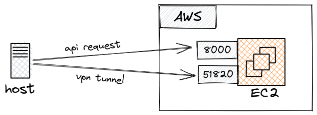

# wireguard

## Description
On-demand personal VPN using:
- **AmneziaWG** (WireGuard fork with DPI obfuscation) via [wg-easy](https://github.com/wg-easy/wg-easy) (Docker)
- **AWS** as cloud provider (spot instance for cost savings)
- **Terraform** for infrastructure
- **AWS SSM Session Manager** for secure panel access (no SSH, no open port 22)

## DPI Protection

Standard WireGuard has a recognizable handshake signature that Deep Packet Inspection (DPI) systems can detect and block without decrypting traffic. This setup uses **AmneziaWG** — a WireGuard fork that injects junk packets and scrambles headers to make the tunnel unrecognizable to censors.

> wg-easy runs AmneziaWG's userspace implementation (`amneziawg-go`, bundled in the image) and auto-configures obfuscation parameters (Jc, Jmin, Jmax, S1, S2, H1-H4) at first startup — no kernel module install required.

**Clients must use AmneziaWG-compatible apps** (standard WireGuard apps will not connect):
| Platform | App |
|----------|-----|
| iOS / macOS | [AmneziaWG](https://apps.apple.com/app/amneziawg/id6478942960) or Amnezia VPN |
| Android | [AmneziaWG](https://play.google.com/store/apps/details?id=org.amnezia.awg), WG Tunnel, or Amnezia VPN |
| Windows / Linux | [AmneziaWG client](https://github.com/amnezia-vpn/amnezia-client) |

## Architecture



A small ARM EC2 spot instance runs wg-easy in Docker. The WireGuard tunnel (port 51820/UDP) is the only port open to the internet. The wg-easy web panel (port 51821) is bound to localhost and accessed exclusively via SSM port forwarding — no SSH keys or bastion required.

## How to Run

### Prerequisites
- Terraform
- AWS CLI configured
- [AWS Session Manager plugin](https://docs.aws.amazon.com/systems-manager/latest/userguide/session-manager-working-with-install-plugin.html)

### 1) Clone this repo
```sh
git clone https://github.com/felipelaptrin/wireguard.git
cd wireguard
```

### 2) Create the infrastructure
```sh
cd terraform
terraform init
terraform apply
```

Wait ~2 minutes for the instance to boot and Docker to start.

### 3) Open the wg-easy panel and create the admin account
Use SSM port forwarding to access the web UI securely:
```sh
bash scripts/tunnel.sh <INSTANCE_ID>
```
The instance ID is printed by `terraform output instance_id`. Then open **http://localhost:51821** in your browser — on first visit, wg-easy shows a setup wizard asking for a username and password. Pick both there; wg-easy v15 has no `PASSWORD_HASH` env var (that was v14-only), so the admin account is always created this way, not via Terraform.

### 4) Add clients
From the wg-easy panel:
- Click **+ Add Client**
- **Mobile (Android/iOS):** scan the QR code with the **AmneziaWG** app (not the standard WireGuard app)
- **Desktop:** download the `.conf` file and import it into the **AmneziaWG** client

### 5) Destroy when done
```sh
cd terraform
terraform destroy
```
